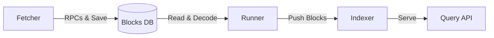

# Project Guidelines (AI-Friendly)

## CLI Reference

### Production Server
- **Command:** `go run ./cmd/server`
- **Scope:** Starts all enabled indexers.
- **Persistence:** Runs indefinitely.

### Developer Test Tool
- **Command:** `go run ./cmd/test <indexer_name> [--fresh]`
- **Scope:** Single indexer target.
- **Behavior:** Drops data (if `--fresh`), syncs blocks, runs `selftest.go`, verifies against Glacier, exits.
- **Example (Pending Rewards):** `go run ./cmd/test pending_rewards --fresh`
- **Example (UTXOs):** `go run ./cmd/test utxos` (re-runs tests on existing data)

### Syntax Verification
- **Command:** `go build -o /tmp/server ./cmd/server && go build -o /tmp/test ./cmd/test`
- **Invariant:** NEVER build into the working directory; always use `-o /tmp/...`.

## Core Invariants (Do Not Break)

1. **Hierarchy:** `Fetcher` → `Blocks DB` → `Runner` → `Indexer`.
2. **Fetcher Responsibility:** ONLY place for RPC calls. Must store raw and augmented data (e.g., Reward UTXOs).
3. **Runner Responsibility:** ONLY place for decoding the Blocks DB format. Passes structured blocks to Indexers.
4. **Indexer Responsibility:** Pure data transformation. **Zero I/O, Zero RPC.**
5. **Storage:** All writes (Pebble, SQLite) must be atomic. No graceful shutdown needed.
6. **Error Handling:** Fail fast and loud. Never swallow errors.
7. **Referential Integrity:** Use Glacier API for validation in `selftest.go`, but **never** depend on it for serving data.

## Architecture & Data Flow

### Pipeline: Fetcher → Runner → Indexer

| Component | Files | Role | I/O / Network |
| :--- | :--- | :--- | :--- |
| **Fetcher** | `pchain/`, `xchain/` | Fetches blocks + rewards. | Host RPC (Allowed) |
| **Blocks DB** | `db/` | Permanent blob storage. | Disk (Write-only once) |
| **Runner** | `runner/` | Decodes `[len][bytes][reward_count][...]`. | Disk (Read-only) |
| **Indexer** | `indexers/` | Maintains state (SQLite/Pebble). | Disk (State storage) |

### P-Chain Fetcher Specifics
- Stored format: `[block_len][block_bytes][reward_count][reward_utxos...]`
- Includes `RewardValidatorTx` UTXOs during initial block fetch.
- Retries: 3 attempts with 2s delay.

## Development Workflow

1.  **Iterative Testing:** Run `go run ./cmd/test <name> --fresh` repeatedly.
2.  **Debugging:** Use `Only: true` in `TestCase` (`selftest.go`) to isolate failures and avoid Glacier 429s.
3.  **Notes:** Maintain `notes/XX_TASK_NAME.md`.
    - **CRITICAL:** Create this file **BEFORE** starting any implementation.
    - It serves as a persistent log and plan to recover context after cleanups.
    - Focus on `What` and `Why` (no code snippets).
    - Use checkboxes to track progress.
4.  **Environment:** Sync `.env` changes to `.env.example`.

## Self-Testing Strategy

Current self-tests compare against live Glacier API. For **new indexers**, consider whether the data is:

- **Live/Current State** (e.g., pending rewards, network stats, active validators) → Must use live Glacier comparison
- **Historical/Immutable** (e.g., historical rewards, past balances, asset metadata) → Can use golden file fixtures

For historical data, golden files avoid rate limits and enable offline testing. See `notes/34_golden_file_testing.md` for the full classification and implementation plan.

## Operational Safety

- **Process Control:** Never use `pkill -f server` (kills the agent server). Use `pkill -f cmd/server` if necessary, or let the IDE handle it.
- **File Ops:** Use `mv` to move files. Do not delete and recreate.
- **Validation:** Always verify with `go run ./cmd/test <indexer>` before submitting.

## Reference & External Data

- **Avalanche Source:** `~/avalanchego/` (Local reference for types and logic).
- **Glacier API:** Used **only** as a ground truth for `selftest.go`.
    - **Constraint:** The indexer must be 100% functional using only an Avalanche Node RPC.
    - **Parity:** We aim for API parity with Glacier where specified.